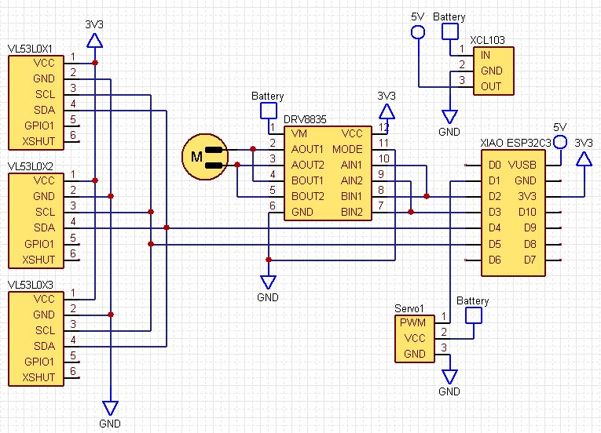
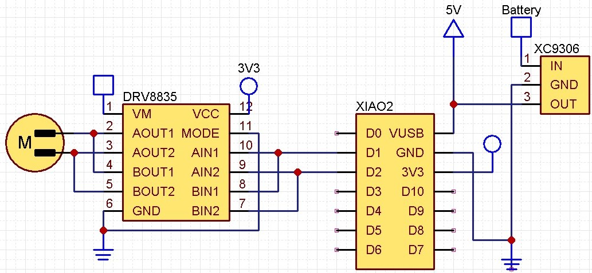

# RumiCar-C3

## 車体

3DプリンターはPrusa MK4、フィラメントはPLAフィラメントを使用しています。  
[部品表](./部品表.xlsx)  
本で見つけたアッカーマン・ジャントー方式を取り入れてみました。  
サーボモーターでステアリングを操作できます。  

### 内部構造

### 外装  

### 3Dプリンターで作ったもの  

### 動画

再生リスト：<https://www.youtube.com/playlist?list=PLf-eJAxvr1HPKLeXOhiYX_KXZIVGUdm03>  

<iframe width="560" height="315" src="https://www.youtube.com/embed/dodTnEqyTwQ?si=Yunk_PS4A1T8-8K-" title="YouTube video player" frameborder="0" allow="accelerometer; autoplay; clipboard-write; encrypted-media; gyroscope; picture-in-picture; web-share" allowfullscreen></iframe>

<iframe width="560" height="315" src="https://www.youtube.com/embed/xrC0_TiMY44?si=yb-NVTNvAgeLHhlM" title="YouTube video player" frameborder="0" allow="accelerometer; autoplay; clipboard-write; encrypted-media; gyroscope; picture-in-picture; web-share" allowfullscreen></iframe>

## 回路、プログラム

### DRV8835

<https://404background.com/circuit/drv8835/>  
<https://youtu.be/BTHzUvILtWA>  
  

### VL53L0X

### WiFi AP(XIAO ESP32C3)

スマートフォンからコントロールするためのプログラムです。  
<https://404background.com/program/esp32c3-4/>

## 関連記事

学生ファブリケーション2024  
<https://404background.com/made/exhibition/the-deck-2024-1-13/>
