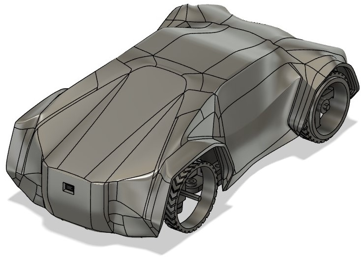

# RumiCar-for-Node-RED-MCU

## 試作

### 車体

[部品表](./部品表.xlsx)  
本で見つけたアッカーマン・ジャントー方式を取り入れてみました。  
内部構造

外装  

3Dプリンターで作ったもの  

動画：<https://youtu.be/6bydSzUHpmo>

### 回路図

## 車体について

Fusion360で設計しています。  
3DプリンターはPrusa MK4、フィラメントはPLAで出力しています。  

## 回路について

### DRV8835

<https://404background.com/circuit/drv8835/>  
<https://youtu.be/BTHzUvILtWA>  
  

### VL53L0X

### WiFi AP(XIAO ESP32C3)

スマートフォンからコントロールするためのプログラムです。  
<https://404background.com/program/esp32c3-4/>
