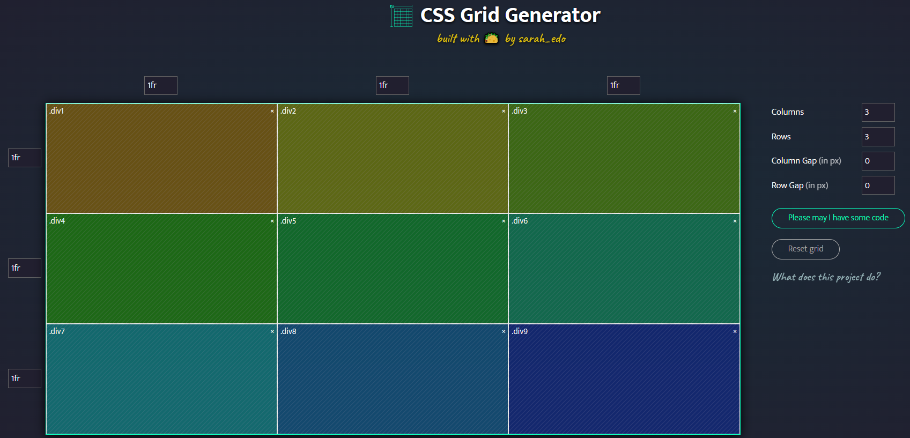

# ESP32C3をスマートフォンやPCとWiFi接続して、ブラウザから操作する場合

Arduino IDEで書き込むため、コントローラ画面はC/C++のプログラム内で、文字列としてHTMLを記述することになります。  
この場合、文字列の中に含まれるダブルクォーテーションを正しく認識するため、エスケープシーケンスが必要です。  
また、複数行の文字列にするため、行末にバックスラッシュも必要です。  

このフォルダの**html_converter.py**は、html形式のテキストをC/C++で使用できるように変換するプログラムです。  

## 使い方

ターミナルでこのフォルダ内に移動して、  
`python html_converter.py HTMLのファイル名`  
を実行してください。  

tmpファイルの形式で生成されます。（.gitignoreの対象です）  

## HTMLファイルの作成

サンプルではCSS Gridで画面を構成しています。  
<https://cssgrid-generator.netlify.app/>

